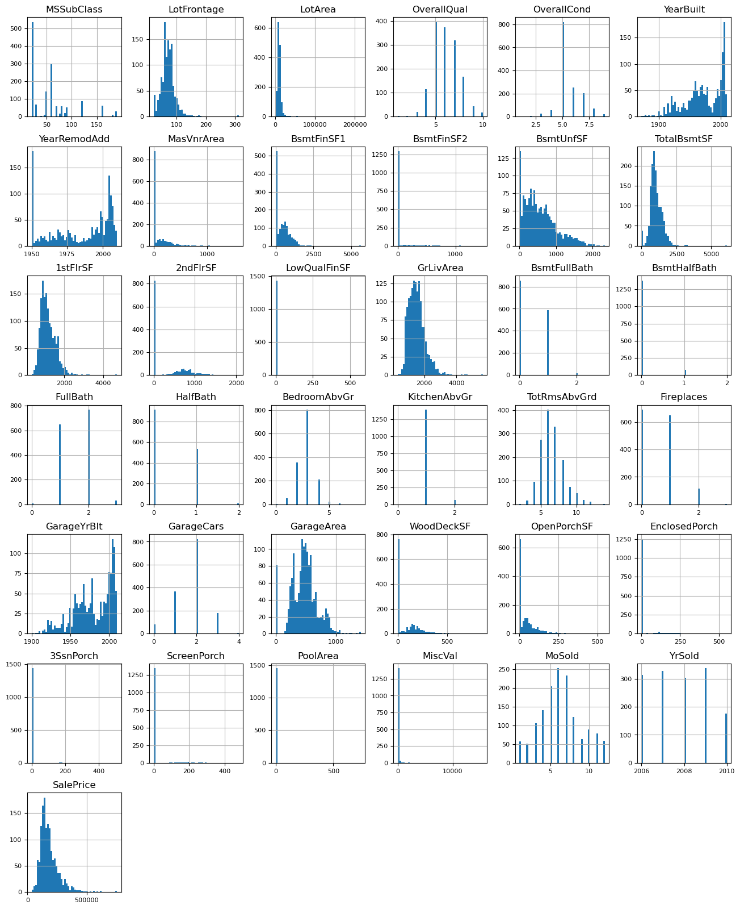

# House Prices Prediction using TensorFlow Decision Forests

## Overview
This project aims to predict house prices using machine learning techniques. Specifically, it demonstrates the process of building a baseline Random Forest model using TensorFlow Decision Forests (TF-DF) to predict house prices based on various features from a dataset of residential homes in Ames, Iowa.

## Objective
The goal of this project is to predict the sales price of houses based on 79 explanatory variables, including characteristics such as the number of rooms, the size of the lot, the year built, and more. This model uses decision forests to make accurate predictions, and the project provides a detailed workflow for building, evaluating, and refining the model.

## Dataset
The dataset used in this project is the **House Prices dataset**, which contains:
- 1460 rows (homes)
- 81 columns (79 features and 1 target column: `SalePrice`)

The dataset includes information about various aspects of residential properties, including structural details and the final sale price. The primary task is to predict the `SalePrice` variable.

## Methods

### Preprocessing
1. **Handling Missing Values**: Missing values are addressed, though this is not fully implemented in the initial model.
2. **Dropping Unnecessary Columns**: The `Id` column is removed, as it doesn't contribute to the prediction.
3. **Feature Engineering**: Basic feature inspection is performed, with future work recommended for feature creation and transformation.

### Data Visualization
Several visualizations were created to better understand the data, particularly the distribution of numerical features and the target variable (`SalePrice`). These plots help identify patterns and potential outliers in the dataset.



This plot illustrates the distribution of various numerical features in the dataset, helping in identifying outliers or patterns that may influence house prices.

### Distribution of Sale Prices


This figure shows the distribution of `SalePrice`. The plot indicates that most homes are priced around $200,000, with a skew towards higher prices.

### Model Selection
A **Random Forest** model is used as the baseline for this project. The model is robust to overfitting and is simple to use, making it ideal for this task. Other models, such as **GradientBoostedTrees** or **CART** models, could be explored in future work.

### Model Evaluation
The model is evaluated using the **Out of Bag (OOB)** score and **Root Mean Squared Error (RMSE)**. These metrics help assess the accuracy and performance of the Random Forest model.


This plot shows the RMSE score based on the number of trees in the Random Forest model. Smaller RMSE values indicate better performance.

### Variable Importance
The importance of various features is evaluated using the `NUM AS ROOT` metric, which identifies the most influential features in the model.


This plot illustrates the variable importance in the Random Forest model, showing which features, such as lot area and overall quality, contribute the most to predicting house prices.

## Results
The Random Forest model provides a solid baseline for house price prediction. Important features such as **lot area**, **overall quality**, and **year built** significantly contribute to price prediction.

The model performs well overall, though some biases are observed in extreme price ranges. Further improvements, such as hyperparameter tuning and incorporating external data (e.g., economic indicators), can enhance the model’s performance.

## Future Work
- Hyperparameter tuning to optimize the Random Forest model.
- Exploration of other models like **Gradient Boosted Trees** or **Deep Learning** approaches.
- Incorporation of external market data to further improve prediction accuracy.
- Extensive feature engineering and missing value handling.

## Requirements
- **Python 3.x**
- **TensorFlow** and **TensorFlow Decision Forests**
- **Pandas**
- **Matplotlib**
- **Seaborn**

### Installation
To set up the environment and run the project:

1. Install required libraries:
   ```bash
   pip install tensorflow tensorflow-decision-forests pandas matplotlib seaborn

2. Load the dataset and run the model in a Jupyter notebook.

## References
- [TensorFlow Decision Forests Documentation](https://www.tensorflow.org/decision_forests)
- [House Prices Dataset on Kaggle](https://www.kaggle.com/c/house-prices-advanced-regression-techniques)
